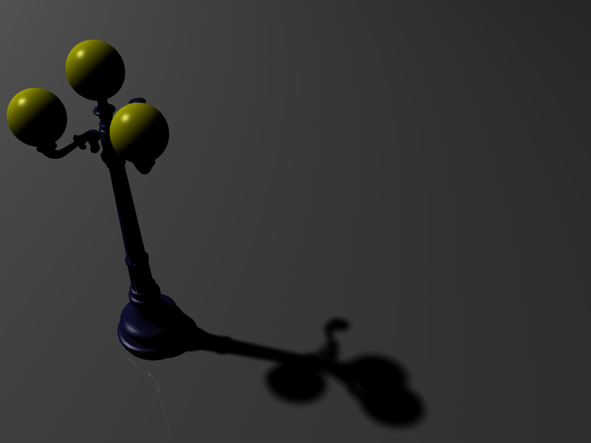
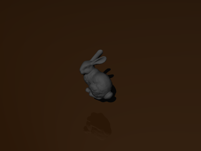

# Raytra



- A raytracer written in C++, featuring:
  - Blinn-phong shading
  - Reflection
  - Soft shadowing
  - Smooth normals
  - Acceleration structure: BVH Tree
- Coming up: refraction

## Dependencies

- OpenEXR:
    - `raytra` outputs EXR images by default
    - For Mac OS X, OpenEXR can be installed via Homwbrew by running
    ```
    brew install openexr
    ```
    - For other systems, please refer to http://www.openexr.com/ for more information

## Getting started

```
make
./raytra scene-files/bunny.scn bunny.exr 3 1
open bunny.exr # `bunny.exr` is the output of the renderer
```

Here's the output:



The general usage of `raytra` is:

```
./raytra <scene-filename> <output-filename> <camera-sample-count> <shadow-sample-count>
```

- `<camera-sample-count>` is the number of primary rays from the camera
- `<shadow-sample-count>` is the number of shadow rays per pixel
- For better performance, build `raytra` by `make release`, which does not contain the debug flag (`-g`) and has `-O3` optimization flag enabled.
